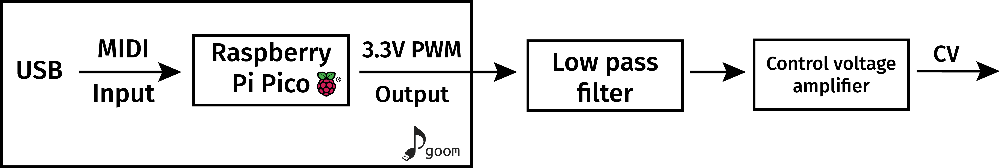

<p align="center">
  
<br>
Raspberry Pi Pico USB MIDI to volt-per-octave control voltage for analogue synthesisers.
</p>

------

This a barebones TinyUSB USB MIDI interface (eg., from DAWs) to control voltage for synthesisers, so shouldn't require any additional software setup or drivers. The output of the Pico is a pulse width modulated (PWM) 3.3V signal, so the control voltage is obtained by using a low pass filter to achieve a DC signal, and then amplified to the correct 12V volt-per-octave standard. At the moment this is just for pitch control, without any gate.

The PWM output is on GPIO pin **2**.

<p align="center">
  

Installation
------------

Goom uses only what's included in the Pico SDK (including TinyUSB), so is relatively easy to install using the automatic Pico SDK install.

Providing CMake is already installed, you can checkout the package and setup the build directory.
```bash
git clone git@github.com:dpohanlon/goom.git
cd goom
mkdir build
```

Then create the Make files, get the Pico SDK, and build the package.
```bash
cd build
cmake ../
make
```
Finally, copy `goom.uf2` to the mounted Raspberry Pi Pico. The Pico should then be recognised as a MIDI device.
